# eFootball Toolkit PRO

<p align="center">
  <strong>Monitoreo de partidos, overlay y herramientas de red para eFootball en Windows y consolas.</strong>
</p>

<p align="center">
  <a href="README.md"></a>
  <a href="README.en-US.md"></a>
  <a href="README.es-ES.md"></a>
</p>

<p align="center">
  <a href="https://mixdev-br.github.io/eFootballToolkitPRO/?lang=es"><strong>Sitio oficial</strong></a>
  ·
  <a href="https://github.com/MixDev-br/eFootballToolkitPRO/releases/latest"><strong>Descargar versión PRO</strong></a>
  ·
  <a href="https://github.com/MixDev-br/eFootballToolkitPRO/releases/tag/trial-v2.3.0"><strong>Probar en Windows durante 5 días</strong></a>
  ·
  <a href="OPENWRT_MOBILE_GUIDE.md"><strong>Guía Mobile y OpenWrt (portugués)</strong></a>
</p>

<p align="center">
  
  
  
  
</p>

> Este es el canal oficial de distribución de eFootball Toolkit PRO. El repositorio contiene los paquetes listos para usar, el manifiesto de actualización y la documentación pública.

## Descripción general

El Toolkit reúne información que normalmente está dispersa u oculta durante la búsqueda de partidos:

- ping, región, distancia y endpoint de la sesión en tiempo real;
- identificación de partidos P2P y partidos alojados en servidor;
- overlay compacto sobre el juego;
- central de servidores con mediciones por país;
- modos y reglas temporales de firewall;
- historial de partidos, adversarios y reencuentros;
- diagnóstico de controles Xbox y PlayStation;
- compatibilidad con eFootball de **Steam** y **Xbox PC**;
- monitoreo de PC, PlayStation y Xbox mediante **OpenWrt**;
- aplicación Mobile para seguir los partidos y controlar los modos X1 y COOP.

## Conoce la aplicación

### Monitor del partido

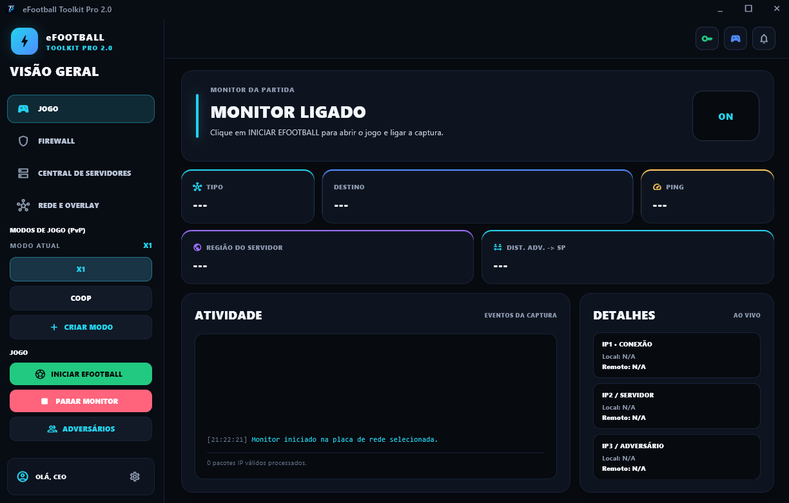

La pantalla principal concentra el estado de la captura y la información de la sesión. Cuando se encuentra un partido, el panel muestra:

- **tipo de conexión**, como P2P o servidor;
- **destino y protocolo** utilizados por el partido;
- **ping**, región identificada y distancia aproximada;
- eventos importantes en el panel **Actividad**;
- detalles de conexión, servidor y adversario en los campos **IP1, IP2 e IP3**;
- accesos directos para iniciar eFootball, controlar el monitor, cambiar el modo de juego y abrir la central de adversarios.

### Firewall y modos de juego

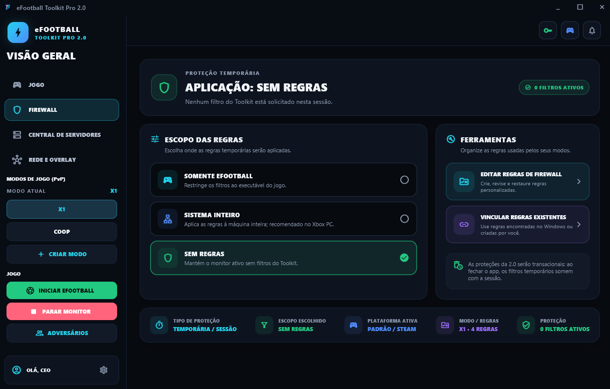

El área de Firewall controla dónde se aplicarán las reglas temporales del modo elegido:

- **Solo eFootball:** limita los filtros al ejecutable del juego;
- **Sistema completo:** aplica el modo a todo el equipo y se recomienda para la edición Xbox PC;
- **Sin reglas:** mantiene el monitor activo sin solicitar filtros del Toolkit.

El panel también informa el alcance elegido, la plataforma detectada, el modo activo y la cantidad de filtros aplicados. Las protecciones son temporales y desaparecen cuando finaliza la sesión de la aplicación.

<details>
<summary><strong>Editor de reglas personalizadas</strong></summary>

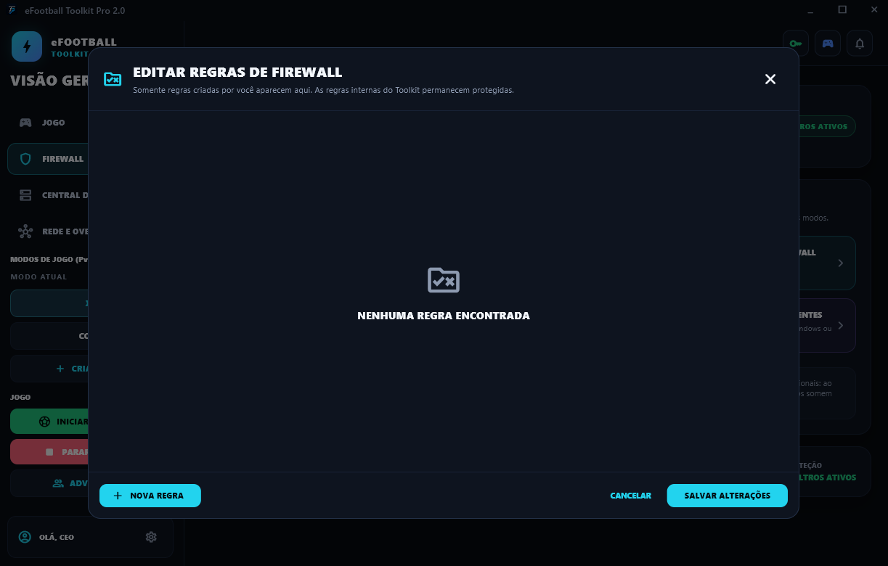

El editor permite crear, revisar y restaurar reglas personalizadas. En esta pantalla solo aparecen reglas creadas por el usuario o encontradas en Windows; las definiciones internas del Toolkit permanecen protegidas.

</details>

<details>
<summary><strong>Vincular reglas existentes de Windows</strong></summary>

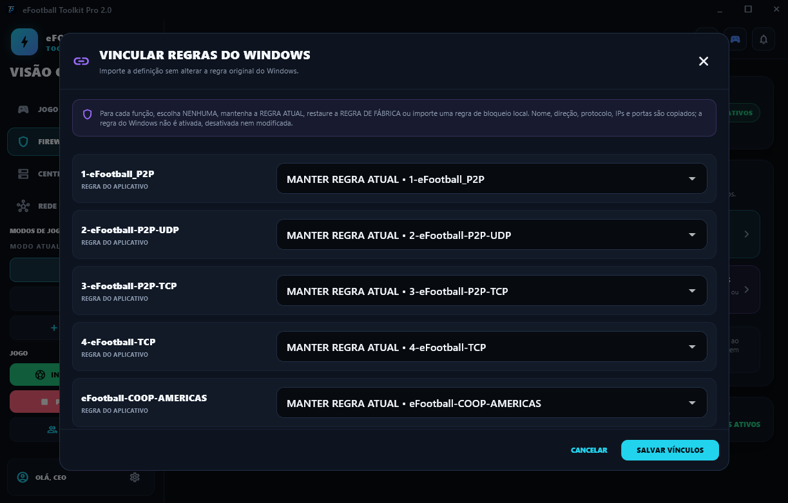

Esta ventana permite aprovechar en las funciones del Toolkit definiciones que ya existen en el Firewall de Windows. El nombre, la dirección, el protocolo, las direcciones y los puertos se importan sin activar, desactivar ni modificar la regla original.

</details>

### Central de servidores

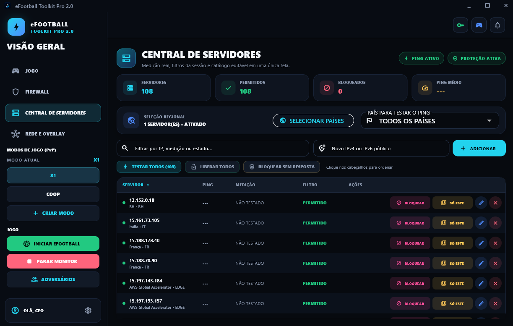

La central organiza los servidores conocidos en una lista compacta con país, dirección, estado del filtro y resultado de la medición. Desde ella es posible:

- probar todos los destinos o elegir un país específico;
- buscar por IP, medición o estado;
- añadir una dirección IPv4 o IPv6 pública;
- bloquear, permitir, editar o probar un solo servidor;
- consultar cuántos destinos están permitidos, bloqueados y disponibles.

Los resultados mostrados son mediciones reales. Cuando un destino no responde, el Toolkit mantiene el estado como no probado o sin respuesta en lugar de inventar un valor de ping.

<details>
<summary><strong>Selección regional</strong></summary>

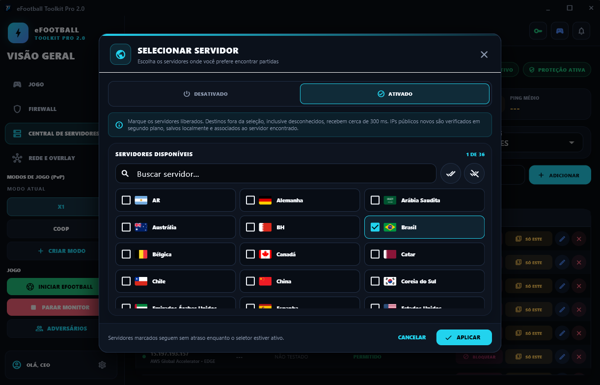

El selector regional ayuda a priorizar países durante la búsqueda de partidos. El usuario elige los destinos preferidos mientras el Toolkit trata temporalmente los demás destinos durante la búsqueda. Las nuevas direcciones IP públicas observadas pueden verificarse y catalogarse localmente.

Esta función ayuda con la selección, pero no garantiza que el partido se organice en una región específica.

</details>

### Red y overlay

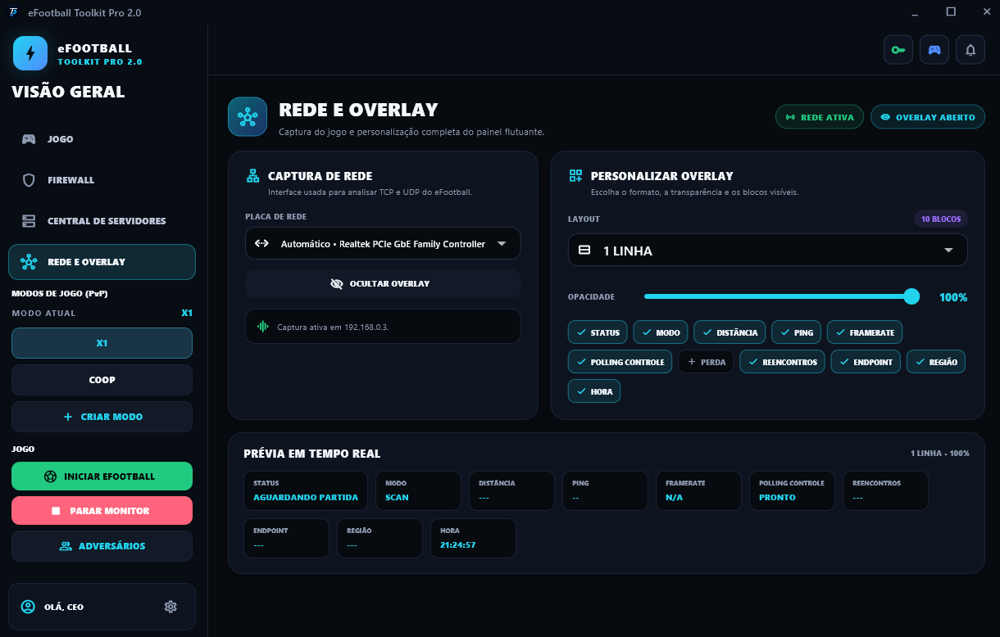

En esta pantalla el usuario elige el adaptador de red utilizado para la captura y personaliza el panel flotante:

- formato de una o dos líneas;
- nivel de opacidad;
- bloques de información visibles;
- estado, modo, distancia, ping y pérdida;
- FPS, polling del control, reencuentros, endpoint, región y hora;
- vista previa instantánea antes de volver al juego.

#### Overlay durante el juego

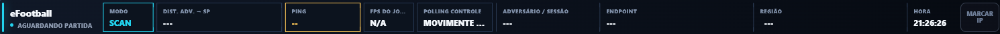

El overlay mantiene visibles los datos esenciales sin ocupar la pantalla principal. Sigue el partido en tiempo real y puede mostrar únicamente los campos elegidos por el usuario. Cuando la sesión permite marcar a un adversario, el botón **Marcar IP** aparece a la derecha.

### Central de adversarios y partidos

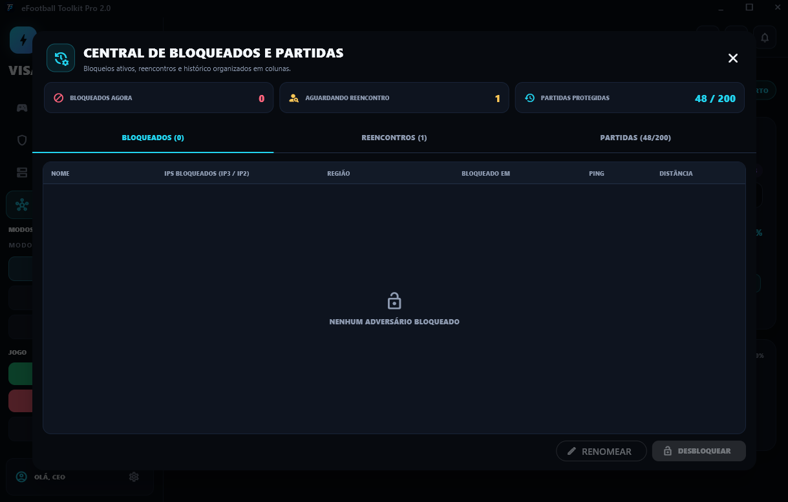

La central separa la información en tres listas:

- **Bloqueados ahora:** filtros activos en la sesión actual;
- **Reencuentros:** adversarios marcados para una identificación futura;
- **Partidos:** historial de las sesiones protegidas.

Las columnas reúnen nombre, direcciones IP observadas, región, fecha, ping y distancia cuando estos datos están disponibles. El bloqueo automático es una protección auxiliar: los cambios de IP, las conexiones compartidas o las decisiones de la propia infraestructura del juego pueden impedir la cancelación automática de un partido.

### Probador de controles

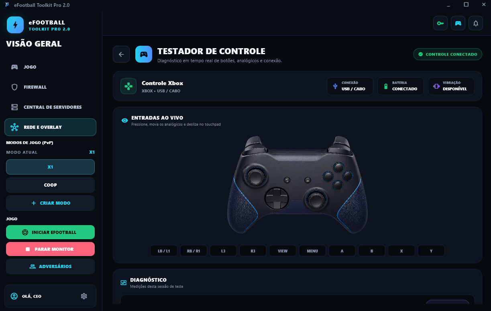

La herramienta de diagnóstico reconoce controles compatibles y presenta una representación visual adecuada para Xbox o PlayStation. Los botones, gatillos y sticks analógicos reaccionan a las entradas en tiempo real.

Cuando el dispositivo ofrece la información necesaria, la pantalla también muestra:

- tipo de conexión;
- estado de la batería;
- compatibilidad con vibración;
- tasa de polling e intervalo medio;
- comportamiento de los sticks analógicos y entradas pulsadas.

### Configuración

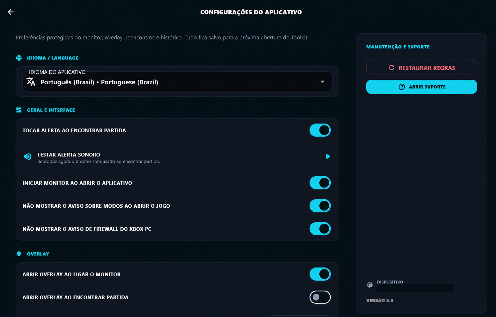

Las preferencias se reúnen en una sola pantalla y se restauran en la siguiente apertura del Toolkit. Entre las opciones se encuentran:

- portugués, inglés y español;
- alerta sonora al encontrar un partido;
- inicio automático del monitor;
- apertura automática del overlay;
- avisos sobre modos y Xbox PC;
- restauración de las reglas de la aplicación;
- acceso directo al soporte.

El código del dispositivo se ocultó en la captura pública por seguridad.

## Trial y PRO

| Función | Trial | PRO |
|---|:---:|:---:|
| Duración | 5 días | Según el plan |
| Monitor de partidos | Completo | Completo |
| Overlay | 1 línea esencial | Personalizable |
| Modos de juego | X1 | X1, COOP y personalizados |
| Central de servidores | — | Completa |
| Historial y adversarios | — | Completo |
| Herramientas de firewall | Limitadas | Completas |
| Clave o tarjeta para probar | No | — |

## Descargas

- [Descargar eFootball Toolkit PRO 2.3.0](https://github.com/MixDev-br/eFootballToolkitPRO/releases/download/v2.3.0/eFootball-Toolkit-PRO-v2.3.0.zip)
- [Descargar eFootball Toolkit TRIAL 2.3.0](https://github.com/MixDev-br/eFootballToolkitPRO/releases/download/trial-v2.3.0/eFootball-Toolkit-TRIAL-v2.3.0.zip)
- [Descargar eFootball Toolkit Mobile 2.3.0](https://github.com/MixDev-br/eFootballToolkitPRO/releases/download/v2.3.0/eFootball-Toolkit-Mobile-v2.3.0.apk)
- [Configurar Mobile y OpenWrt (guía en portugués)](OPENWRT_MOBILE_GUIDE.md)
- [Consultar todas las versiones](https://github.com/MixDev-br/eFootballToolkitPRO/releases)

Cada versión incluye el paquete `.zip`, un archivo `.sha256` para verificar su integridad y las notas de actualización.

## Requisitos

- Windows 10 o Windows 11;
- eFootball para Steam o Xbox PC;
- privilegios de administrador para los filtros temporales;
- [Npcap](https://npcap.com/#download) instalado.

**Npcap** es el componente utilizado para observar el tráfico de red local necesario para las mediciones del monitor. Descárgalo únicamente desde el sitio oficial.

## Instalación

1. Instala el [Npcap oficial](https://npcap.com/#download).
2. Descarga la edición PRO o Trial desde Releases.
3. Extrae **todo el contenido** del archivo ZIP.
4. Mantén el ejecutable junto a la carpeta `runtime`.
5. Ejecuta `eFootballToolkitPRO.exe`.

No muevas ni ejecutes el archivo `.exe` de forma aislada.

## Actualizaciones e integridad

La aplicación consulta el manifiesto firmado `update_manifest.json` de este repositorio. Los paquetes se descargan exclusivamente desde Releases y solo se aceptan después de validar la firma, el tamaño y el hash SHA-256.

Para comprobar manualmente una descarga en PowerShell:

```powershell
Get-FileHash -Algorithm SHA256 .\eFootball-Toolkit-PRO-v2.3.0.zip
```

Compara el resultado con el archivo `.sha256.txt` publicado en la misma Release.

## Soporte

- Sitio: [mixdev-br.github.io/eFootballToolkitPRO](https://mixdev-br.github.io/eFootballToolkitPRO/?lang=es#suporte)
- Correo electrónico: [efootballtoolkitpro.suporte@gmail.com](mailto:efootballtoolkitpro.suporte@gmail.com)

Al solicitar ayuda, indica la versión del Toolkit, si utilizas Steam o Xbox PC y describe el comportamiento observado.

---

eFootball Toolkit PRO es un proyecto independiente y no está afiliado a KONAMI.
